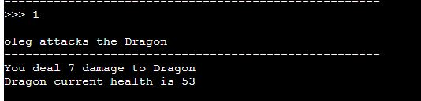

# Dungeon & Dragon

Dungeon & Dragon is a text based RPG fantasy game, which runs in the terminal on Heroku.

User plays as a brave hero exploring the dragon's lair. The aim of the game is to find the lair and defeat the dragon using your skills, and a bit of luck.


## Instructions how to play

The game is a text based, so it is important that user reads all the instructions in the terminal.

In order to act in the game, or chose the options, user has to type the command in the terminal and press `Enter`. Text is not case sensetive, so it won't matter if the user writes command in all lower or all capitilized characters. Possible commands will always be displayed in text instructions, so it is important to enter text identical to the options provided. If user enters incorrect command the program will give an eror message and ask user to enter the correct command.

All the lines where user's input required start with `>>>`.

There is only one type of attack available for the user, however, it got a chance of a critical attack which deals higher damage.

The game is turn based, so when user attacks the dragon the user's turn is over and then computer's turn starts.

User can also use `Potion` to restore the health, however, using the potion will end your turn, meaning you can't attack the same turn as you use the potion.

To win the game user has to defeat the dragon before it kills them. 

It is possible to try and `escape` the fight, but it got a low chance of succseeding.

## Features

### Existing Features

* Naming your character:

    - Player can name their character and game will use that name to address the player

    

    - Player can chose to skip the name selection and press `Enter`, then the game will use default name

    

    - Game will also check to ensure that the name doesnt start with en empty character or a number

    

* Chosing your path:

    - Player will be given a choice of the direction

    

    - Wrong choices can lead to negative concequences 

    

* Treasure chest:

    - In the dungeon user can find a chest with treasuers. Opening it will grant some reward, however, player required to make a sacrifice

    - Depending on the sacrifice player choses to make, reward will be different

    

* Player stats:

    - Health - the most important stat. If it goes down to `0` you lose the game. Base values is `30`, can be restored with potions.

    - Armor - protects the player from the attacks. If armor is `0` then all the damage goes to `health`. Base value is `20`, but can be increased by opening chest

    - Potion - player can drink the potion to restore some of their health. Doesn't restore armor. Base value is `2`, but can be increased or decreased by opening the chest

    - Max attack - the maximum damage player can do with base attack. There is a small chance of `miss` and `critical damage` present. Base attack `7`, but can be increased by opening the chest

    

* Dragon stats:

    - Health - base value is `60`. Cannot be restored. If health goes to `0` then player wins the game

    - Max attack - the maximum damage dragon can do with base attack, and base value is `10`. The is no critical damage

* Fight:

    - Fight is turn based

    - Player got 3 options available:

    

    - By chosing `1` player attacks the dragon. There is a small chance of `miss` and `critical damage`

        


        


        

    - By chosing `2` player will drink the potion and restore some amount of their health

        

    - By chosing `3` player will end the fight, but there is a high chance of losing the game

         

        


* Dragon attacks:

    - Dragon has two types of attacks, which are random:

        - Base attack deals physical damage

        - If player got armor, it will first target the armor. If armor drops to `0` then it will be destroyed and dragon will deal the damage directly to health

        

        - "Fire Breath" deals the fire damage

        - If player got armor, it deals high damage to the armor and small damage to health

        - If player got no armor then it deals high damage to health

        

* Winning the game:

    - To win the game player has to drop Dragon's health to `0`

    

* Losing the game:

    - To lose the game player has to lose all the health

    


### Feature Features

* Allow user to distribute stats instead of hardcoding them

* Add an extra attack or spell for player to use in a fight

* Increase the size of the dungeon

* Add more traps, chest, enemies

* Make random paths


## Data Model

For this game I used Character and Dragon classes for game characters. It allowed me to store and modify the attributes, such as name, health, attack, armor, and potion.

I created functions that would access those attributes and print them out for a user, so user is always aware what the stats are for their character and for the enemy. 

I also created attack functions that would access the `Maxattack` attribute from the class and ue it in the formula to calculate the damage of the attack.

Used `global` variables to containt Character and Dragon class to be able to access their attributes.

### Flowchart Diagram

* Main Gameplay flow diagram:

    

### Libraries

I imported and used the following libraries:

- `random` - used to create a randomize damage from attacks and trap, as well as the chance of critical damage and missed attack. Also, it used when rolling a die to see if escape is succssesful

- `os` - used to run a command ```os.system(`clear`)``` to clear the screen when the fight starts. Helps to keep the console cleaner for the user

- `math` - used `math.floor` and `math.round` when calculating the damage

- `time` - used `time.sleep(1.5)` to reduce the time that instructions appear with, allowing more time for a user to read all of the instructions


## Testing

I tested this project manually by doing the following steps:

* Running the code through PEP8 Python Validator to ensure there are no errors

* Trying invalid inputs to ensure that the game won't accept it:

    - Using empty input or incorrect input when a specific command required

    - Enter character's name starting with en empty space or with a number

* Tested the app in my local terminal and on Heroku to ensure it runs correctly

### Bugs

#### Fixed Bugs

* First when I started writing the project I couldn't access and modify classes' attributes, so I had to create global variable that would be assign to classes and with their help I could use them in functions to modify the ttributes such as health, attack, and etc

* Originally, the character's name was an empty string and it was required for a player to input the name, however the player could simply press `Enter` without any input and then the name would appear empty. To fix that I assigned the default name in Character class called `Hero`, and then created a loop that checks if user enters anything when assigning the name. If the input is empty then it will use the default name.

* Another problem I found when entering the name is that user could simply enter the empty space as an input by pressing `space bar`, so then the loop would replace the default name with the empty space, and once again the name would be empty. To fix that I created an `if` statement inside the loop that checks if the first character inside the unput is alphabetical. If yes, it will accept the name, if not, then it will ask user to enter the valid name that starts with a letter.

* When writing the code for the damage I used formula `random.randint(maxattack /2, maxattack)`. Sometimes it could give a decimal number as a result, and numbers would start getting more confusing and harder to read for a user. So to fix that, I used `math.floor` and `math.round` to ensure that there are no decimal numbers and all the stats stay clean and easy to read for a user.

#### Unfixed bugs

* There is one bug that I coudn't fix. When working on the enemy attacks with player's armor I wanted to make a functions that checks if enemy's damage is higher than the armor, and if it is then it would reduce the armor to `0` and any excess damage will be caused to the player's health. However, when I tried to write the function I couldn't make the excess health to calculate correctly, so at the end I decided to not implement this function and simply just reduce the armor without any excess damage to health.

#### Validator Testing

* PEP8

    - No errors were returned from PEP8online.com


## Deployment

This project was deployed using Code Institute's mock terminal for Heroku

* Steps for deployment:

    - Fork or clone this repository
    - Create a new Heroku app
    - Set the buildbacks to `Python` and `NodeJS` in that order
    - Link the Heroku app to the repository
    - Click on Deploy

The app is deployed <a href="https://dungeon-and-dragon-041a95b72292.herokuapp.com/">here</a>


## Credits

* Code Institute for the deployment terminal
* <a href="https://www.youtube.com/watch?v=PRuDyx8aU38&t=89s">Run That</a> YouTube tutorial for inspirations and some ideas
* <a href="https://codereview.stackexchange.com/questions/190946/text-based-python-rpg-game">Here</a> I got some ideas for a fight and how to use `global` variables


